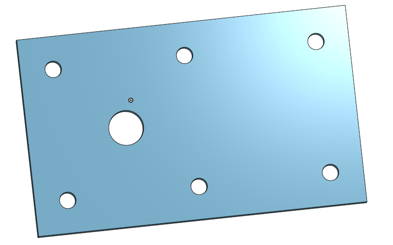
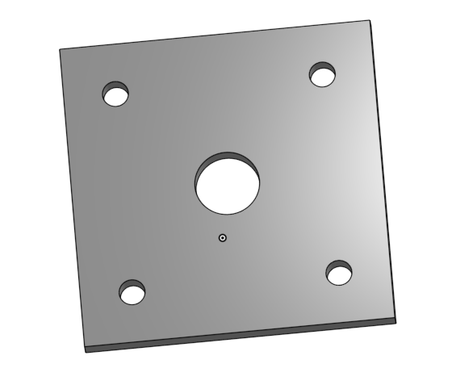
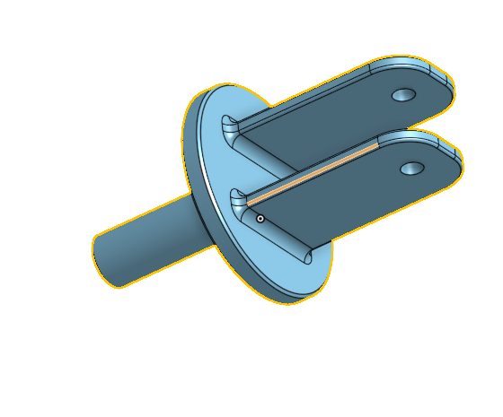
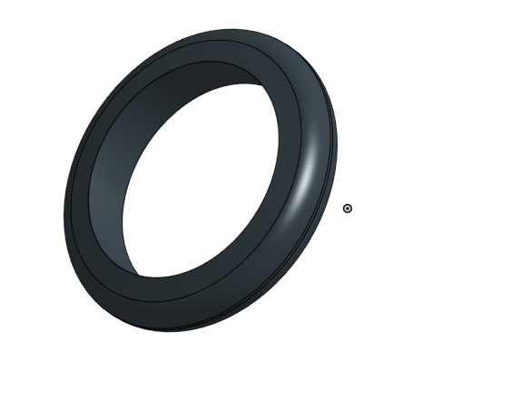
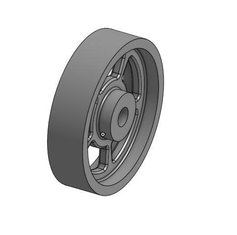
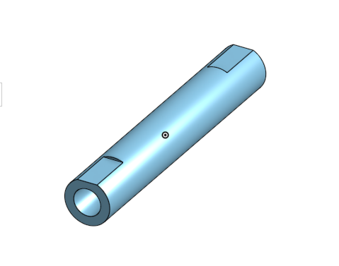
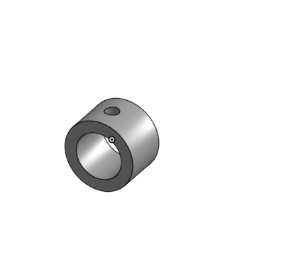
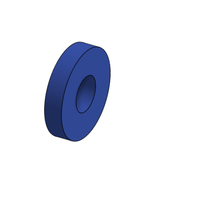

# BasicCAD
We are creating a caster. There are 6 parts Base, Mount, Fork, Tire, Wheel, and AxleCollerBearing

## Base

### Description
The first assignment is to create the caster base. The base's dimensions are 200 mm x 120 mm and 8 mm thick. It has 6 holes 10 mm wide and 20 mm from the edge equally spaced along the edges.

### Evidence
[Base](https://cvilleschools.onshape.com/documents/bd9b5060c8ba772630bb5657/w/65ff90f9d0d5177b4e5b4fdd/e/b25488f87ba4cc5898da9707)

### Image

### Reflection
At first Onshape was pretty hard for me. I just could'nt understand how linear patterns worked. I finaly figured it out with some help. Onshape is so cool, you can do so much stuff.

---

## Mount

### Description
Our second Onshape assignment (the mount) was a countinuation of the first. The mount looks exactly like the base but a bit smaller and with 5 holes instead of 7.
### Evidence
[Mount](https://cvilleschools.onshape.com/documents/bd9b5060c8ba772630bb5657/w/65ff90f9d0d5177b4e5b4fdd/e/b25488f87ba4cc5898da9707)

### Image

### Reflection
The mount was really good for me because it was not that complicated and allowed me to work on the skills I learned with the base. I learned how to create linear patterns on a sketch not just and extrude. At this point I feel like I have mastered the first steps and ready to move on.

---

## Fork

### Description
The fork is a more complicated piece that connects the wheel to the base and the mount. It is a circle with two teeth sticking out one end to hold the wheel in place and a pipe sticking out the other to connect to the base and mount.

### Evidence
[Fork](https://cvilleschools.onshape.com/documents/bd9b5060c8ba772630bb5657/w/65ff90f9d0d5177b4e5b4fdd/e/900e12c49117069e34818e49)

### Image

### Reflection
The fork was the most interesting part so far. It was much more complicated than our first two parts, but I feel like I have really improved my speed at which I use Onshape. The videos Doctor Shields makes are really easy to follow and make understanding Onshape not two difficult. A few skills I learned were how to use filets chamfers and mirrors. Filets are my favorite they greatly increase the number of cool shapes you can make.

---

## Tire

### Description 
Our next onshape assingnment was making the tire of our Caster. The tire has an inner diameter of 80 mm and an outer diametor of 110 mm. 

### Evidence
[Tire](https://cvilleschools.onshape.com/documents/bd9b5060c8ba772630bb5657/w/65ff90f9d0d5177b4e5b4fdd/e/e616b3dc6772a9b41ea6740c)

### Image

### Reflection
The tire was fun but it was not as enjoyable as the fork. We started by making a trapezoid and then revolved it around a point to create or curcular tire. I think we could have just made rectangle instead of the trapezoid and then just use chamfers to slope the sides after we revolved the shape. I do think it was really cool to learn how to revolve a shape and now I want to try to make a sphere.  

---

## Wheel
### Description
### Evidence
[Wheel](https://cvilleschools.onshape.com/documents/bd9b5060c8ba772630bb5657/w/65ff90f9d0d5177b4e5b4fdd/e/e77a2a5a9cbfb9877df0f923)

### Image

### Reflection

---

## AxleCollarBearings
### Description
### Evidence
[Axel and Collar](https://cvilleschools.onshape.com/documents/bd9b5060c8ba772630bb5657/w/65ff90f9d0d5177b4e5b4fdd/e/e77a2a5a9cbfb9877df0f923)

[Bearing](https://cvilleschools.onshape.com/documents/bd9b5060c8ba772630bb5657/w/65ff90f9d0d5177b4e5b4fdd/e/e616b3dc6772a9b41ea6740c)

[Big Bearing](https://cvilleschools.onshape.com/documents/bd9b5060c8ba772630bb5657/w/65ff90f9d0d5177b4e5b4fdd/e/5dc14780f0d9d4fb5d0485b6)

### Image

### Reflection

