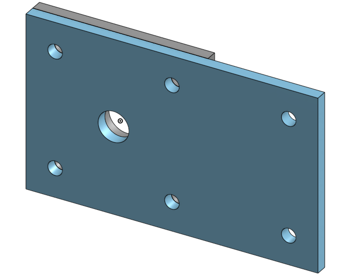
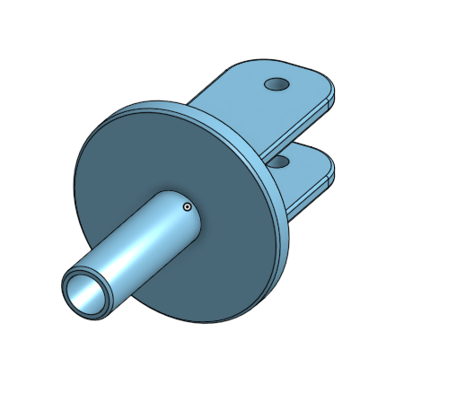

# Basiccad CHS 2020-2021
## Description
My first basic cad assignment was making a castor. This was the first time I had ever done anything with CAD, so it was all new to me. 
### Base and Mount
#### Image

#### Reflection
The base and the mount were really not that intresting because they are basicly the exact same piece. I do feel like I am getting a good grasp of how linear patterns work.
### Fork
#### Image

#### Reflection
I really enjoyed this part, even more then the mount. It was more complicated and we got to learn some new tools. I completed it in a resonable amount of time.

